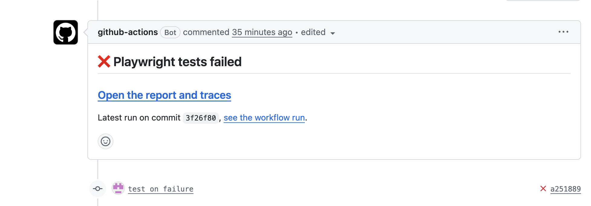

# Playwright Tests with CI Reporting

Playwright tests for the public
[GitHub Profile README Generator](https://rahuldkjain.github.io/gh-profile-readme-generator/),
with CI that reports failures directly on pull requests.

I can't share code from previous jobs, so this repo recreates a change I made
there, on a public site anyone can run.

## The feedback

After I added Playwright tests to CI, the developers suggested it could be
easier to see why a test failed. At the time, finding out meant digging through
logs or downloading and unzipping the report. I agreed there was room to
improve, and we landed on getting the failure details straight onto the pull
request.

## What I changed

- **Tests fail:** the PR gets a comment with one link that opens the report
  straight onto the failed tests, with the error, screenshot, video and trace.
- **Tests pass:** the comment is removed and it's just a green check.

The comment updates on every push, so the link always shows the latest run.



To see it live, one test in
[pull request #2](https://github.com/Yurii-Rab/gh-readme-generator-tests/pull/2)
is broken on purpose. Open the PR and click the link in the comment to go
straight to the failed test and its trace.

## Where to look

- The change itself, with one test failing on purpose: [pull request #2](https://github.com/Yurii-Rab/gh-readme-generator-tests/pull/2)
- The CI workflow changes: [files changed in the PR](https://github.com/Yurii-Rab/gh-readme-generator-tests/pull/2/files)
- The tests: [`tests/`](tests/)

## Running locally

Needs Node.js 18 or newer.

```bash
npm install
npx playwright install chromium
npm test
```
